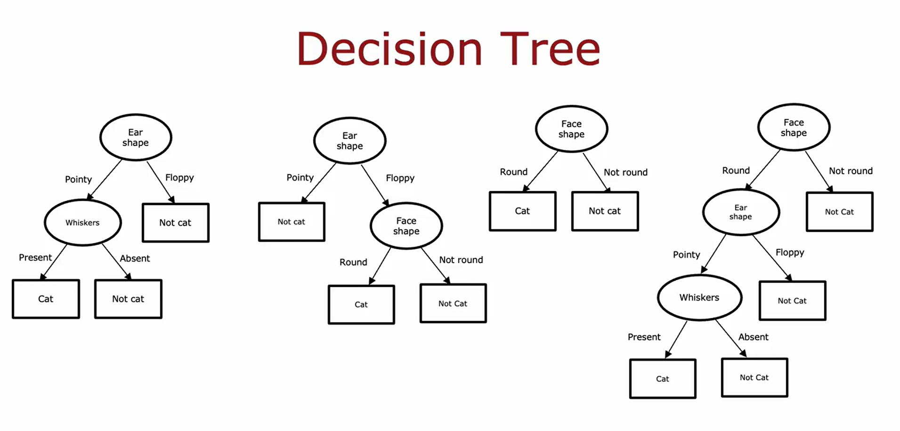
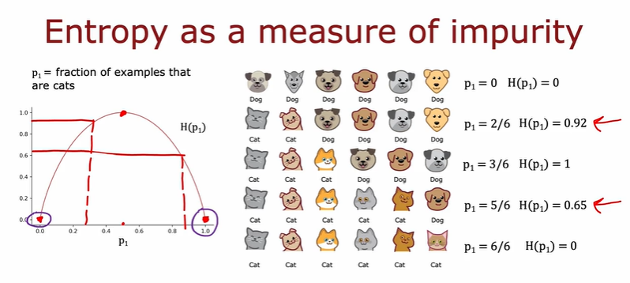
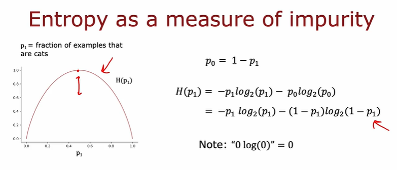
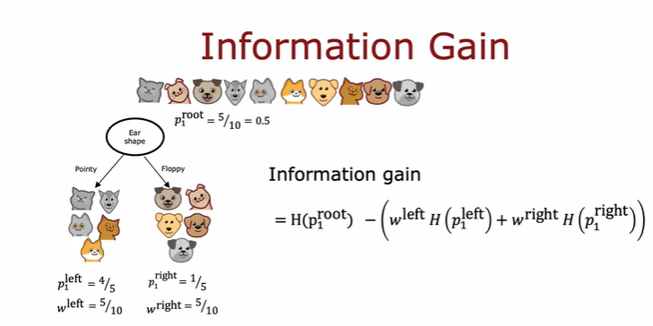
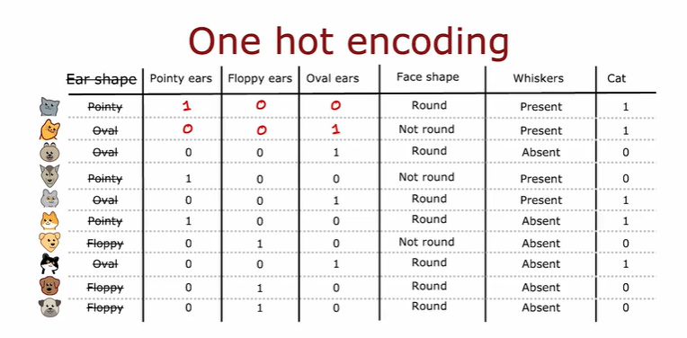
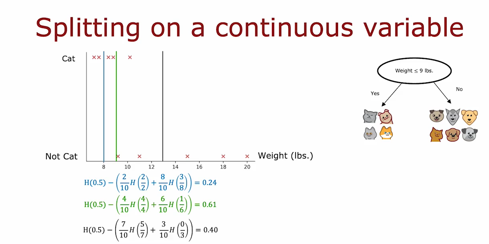
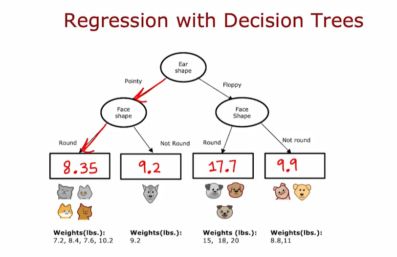
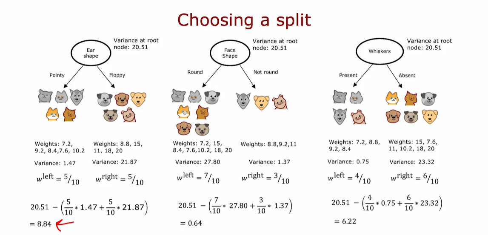

# DECISION TREE MODEL

Decision tree is a flowchart-like structure where:

* Internal nodes represent decisions based on feature values.

* Branches represent the outcome of those decisions.
* Leaf nodes represent final predictions or classifications.

In the course, Andrew Ng uses a playful example: you're running a cat adoption center and want to classify animals as cats or not based on features like:

* Ear shape (pointy or floppy)

* Face shape (round or not round)

* Presence of whiskers

Each feature is categorical and binary, making this a binary classification task.

# DECISION TREE LEARNING
## Decision 1: How to choose what feature to split on at each node ?
* Maximize purity (or minimize impurity)
## Decision 2: When do you stop splitting?
* When a node is 100% one class

* When splitting a node will result in the tree exceeding a maximum depth 

* When improvements in purity score are below a threshold

* When number of examples in a node is below a threshold

# ENTROPY: a measure of impurity

Entropy quantifies how mixed or impure a set of examples is. It’s highest when the data is evenly split between classes (e.g., 50% cats, 50% dogs) and lowest when all examples belong to a single class.

# CHOOSING A SPLIT: INFORMATION GAIN

Choose a split with the highest information gain

# ONE-HOT ENCODING

Essentially if a categorical feature can take on ***k*** values, create ***k*** binary features (0 or 1 valued)

# HOW TO SPLIT ON A CONTINOUS FEATURE?

# REGRESSION TREES

Trying to predict the weights of the particular group of animals

## How to choose a split for this model? 

Instead of calculating entropy, you calculate variance which essentialy tells how widely a set of numbers varies.
And choose the largest reduction.