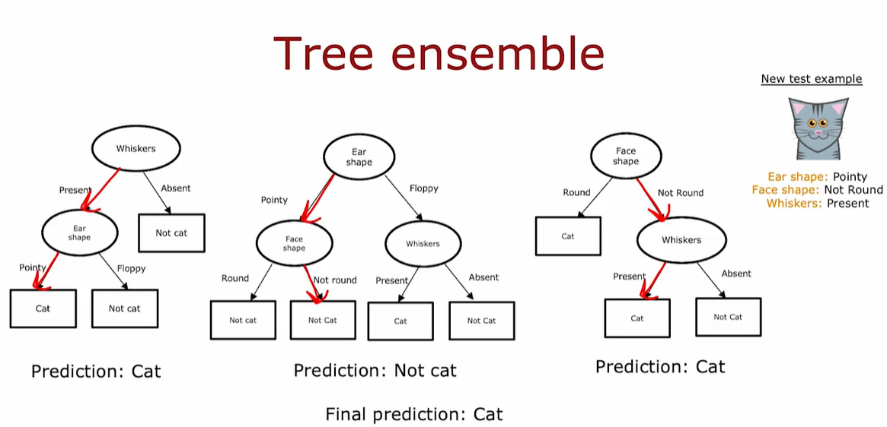
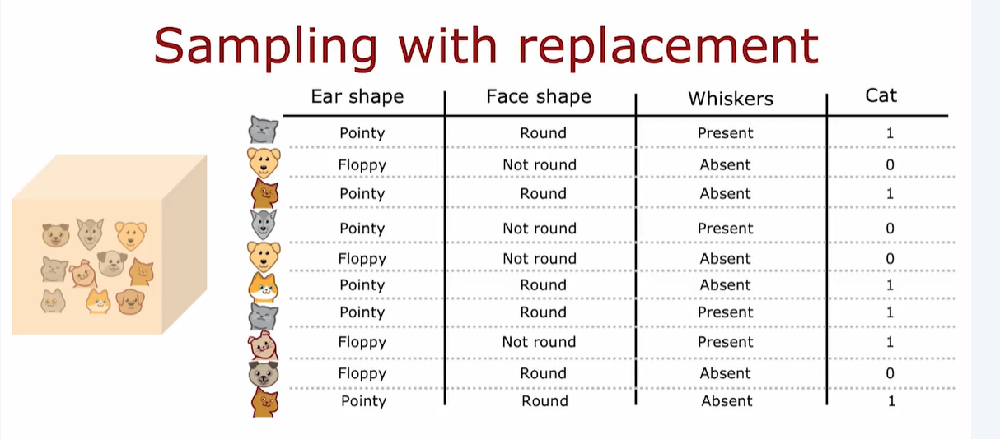
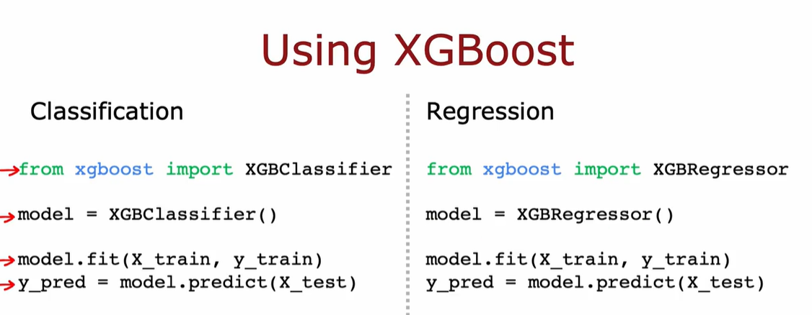

Essentially means a collection of multiple trees. They make inference of a new data and vote on the final prediction.

# SAMPLING WITH REPLACEMENT

This technique lets you construct a new training set that's a little bit similar to, but also pretty different from your original training set.

 It turns out that this would be the key building block for building an ensemble of trees

# RANDOM FOREST
A Random Forest is a collection of decision trees trained on slightly different versions of the training data. Each tree makes its own prediction, and the final output is determined by majority vote (for classification) or average (for regression).

1. Sampling with Replacement (Bagging)

    * From the original training set of size 𝑀, generate
𝐵 new datasets by sampling with replacement. 

    * Each dataset is used to train a separate decision tree.

    * This technique is called bagging (Bootstrap Aggregating)
2. Training Multiple Trees

    * Typical values for 𝐵 (number of trees) range from 64 to 128.

    * More trees generally improve performance, but beyond ~100, gains diminish while computation cost increases.

3. Random Feature Selection at Each Node

    * To increase diversity among trees, each node in a tree only considers a random subset of 𝐾 features (where 𝐾<𝑁, the total number of features).
    
    * A common choice: 𝐾=sqrt(𝑁)

    * This prevents all trees from making the same splits, especially near the root.

4. Voting for Final Prediction

    * Once all trees are trained, they vote on the final prediction.

    * This ensemble approach smooths out errors from individual trees and improves generalization.

# XGBOOST
```
Given training set of size m
For b=1 to B:
    
    Use sampling with replacement to create a new training set of size m
        (*) But instead of picking all examples of equal (1/m) probability, make it more likely to pick misclassified example from previously trained trees
    
    Train a decision tree on the new dataset.
```



# DECISION TREES VS NEURAL NETWORKS
## Decision trees and tree ensembles
* Works well on tabular (structured) data
* Not recommended for unstructured data (images, audio, text)
* Fast
* Small decision trees may be human interpretable
## Neural networks
* Works well on all types of data, including tabular (structured) and unstructured data
* Maybe slower than a decision tree
* Works with transfer learning
* When building a system of multiple models working together, it might be easier to string together multiple neural networks.