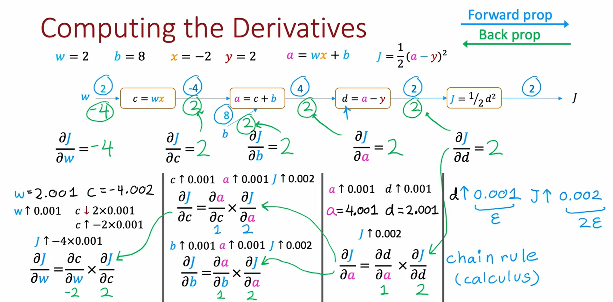

# INTUITION
Backpropagation is the algorithm used to efficiently compute gradients of the cost function with respect to each parameter in a neural network. It’s the backbone of training via gradient descent.
```
Instead of computing each gradient independently, backprop uses shared intermediate derivatives, making it scale well:

If a network has 𝑛 nodes and 𝑝 parameters, backprop computes all gradients in roughly 𝑛+𝑝 steps—not 𝑛×𝑝.
```
