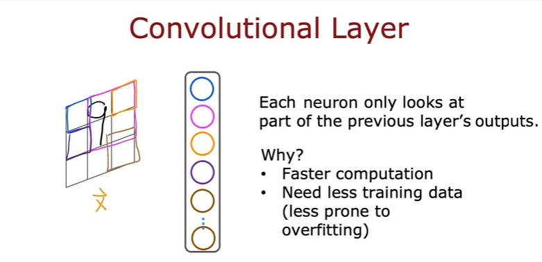
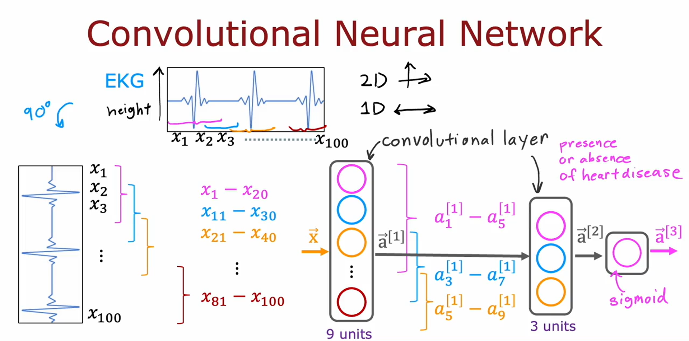
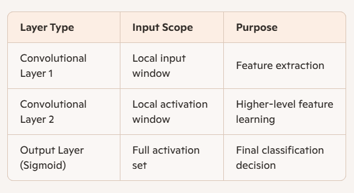

# CONVOLUTIONAL LAYER
A CNN is a type of neural network that uses convolutional layers instead of (or alongside) dense layers. Unlike dense layers where each neuron sees the entire input, convolutional layers restrict each neuron to a local region of the input.


# NETWORK

```
ECG Signal Classification
Input: 100 time steps of ECG data.

First convolutional layer: Neurons look at 20-step windows (e.g., X₁–X₂₀, X₁₁–X₃₀).

Second convolutional layer: Neurons look at windows of activations from the previous layer.

Output layer: Sigmoid unit for binary classification (e.g., presence of heart disease).
```
## Architecture:
