# ARCHITECTURE
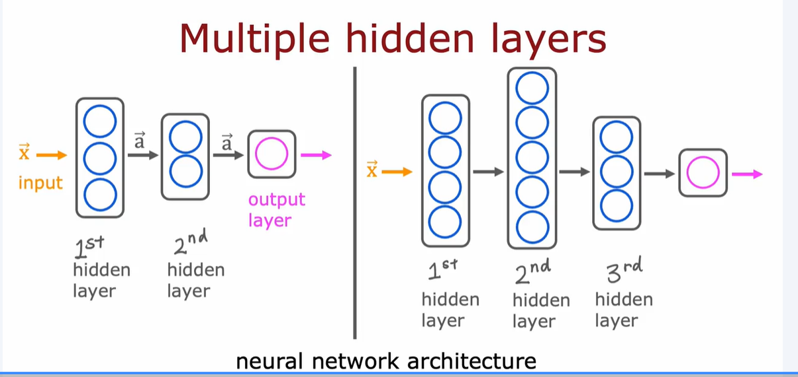
In neural networks, activation refers to the output of a neuron after applying a transformation to its input.
## High level example:
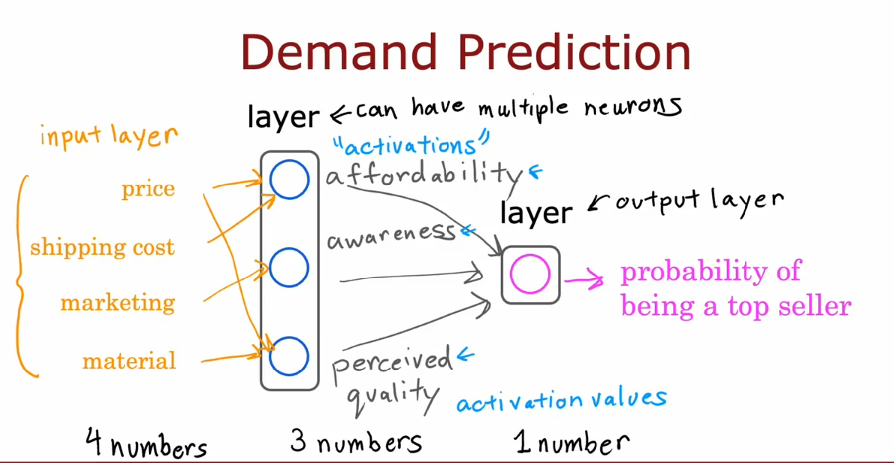
## Low level example:
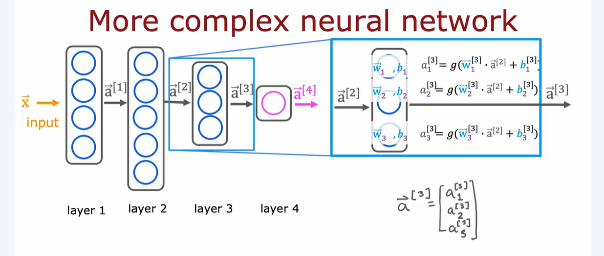

# INFERENCE
Inference refers to the process of using a trained neural network to make predictions on new, unseen data. This is done through an algorithm called forward propagation, where input features are passed through the network layer by layer to compute the final output 𝑓(𝑥), which is the prediction

# TENSORFLOW IMPLEMENTATION
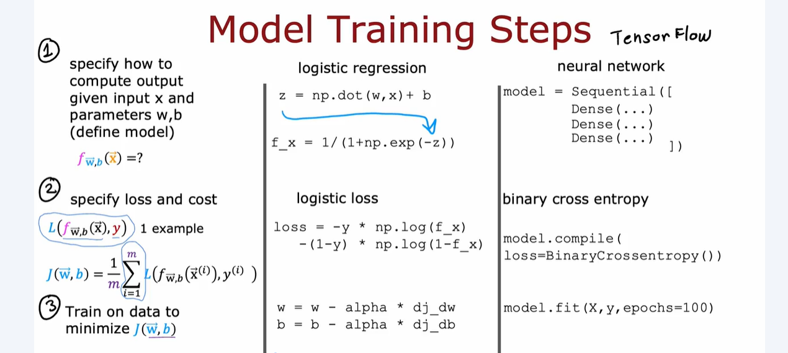

# ACTIVATION FUNCTIONS
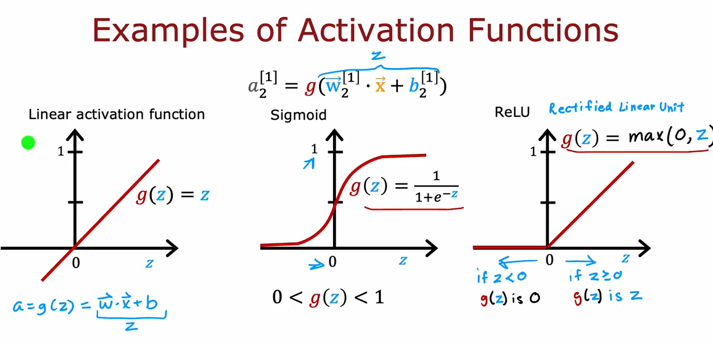

## Linear activation: means no activation at all
## Sigmoid: squashes input into a narrow range (0 to 1)
```
loss = BinaryCrossEntropy()
```

## Tanh: 
$a = tanh(z) = (e^z - e^{-z}) / (e^z + e^{-z})$
## ReLU: Compared to Sigmoid, it’s computationally cheaper—no exponentials, just a simple threshold. And its outputs can ranged from 0 to any positive numbers.
    * ReLU outputs zero for negative inputs, introducing sparsity.

    * Sparse activations reduce interdependence between neurons, improving generalization and reducing overfitting

    * Empirical studies show ReLU often leads to faster training and better performance in deep networks compared to sigmoid.
## Leaky ReLU:
$a= max(0.01z,z)$
# SOFTMAX ACTIVATION: used for multiclass classification 
$$a_j = \frac{e^{z_j}}{ \sum_{k=1}^{N}{e^{z_k} }}$$
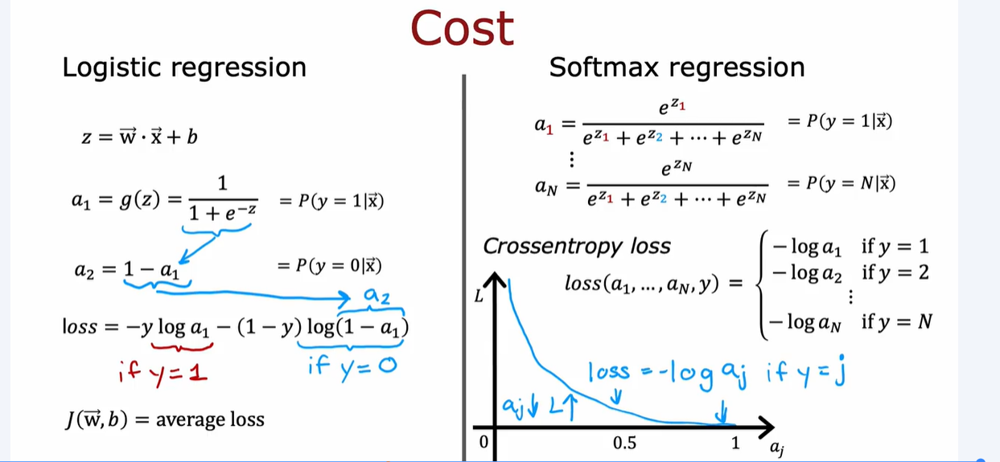
$$L(\mathbf{a},y)=\begin{cases}
    -log(a_1), & \text{if $y=1$}.\\
        &\vdots\\
     -log(a_N), & \text{if $y=N$}
  \end{cases}$$
```
loss= SparseCategoricalCrossentropy()
```
Cost function:
$$J(\mathbf{w},b) = -\frac{1}{m} \left[ \sum_{i=1}^{m} \sum_{j=1}^{N}  1\left\{y^{(i)} == j\right\} \log \frac{e^{z^{(i)}_j}}{\sum_{k=1}^N e^{z^{(i)}_k} }\right] $$

## Optimization for implementation of softmax
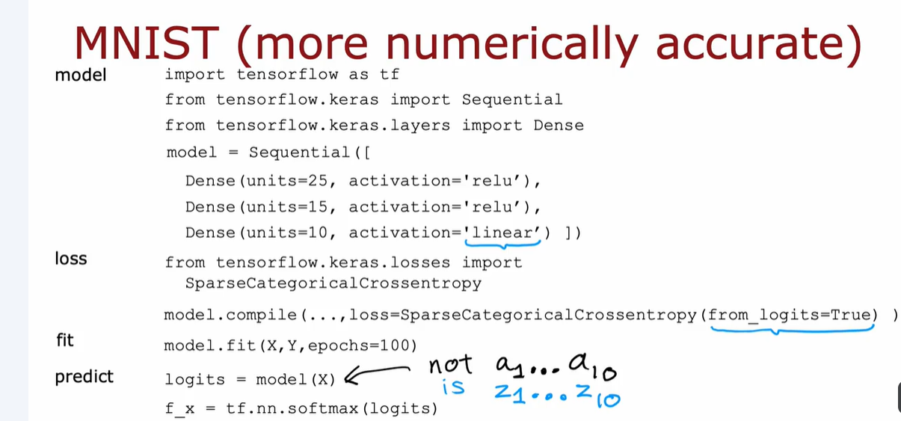

# MULTI-LABEL CLASSICATION
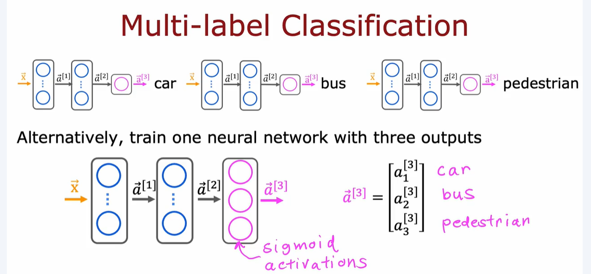

# OPTIMIZER: ADAM
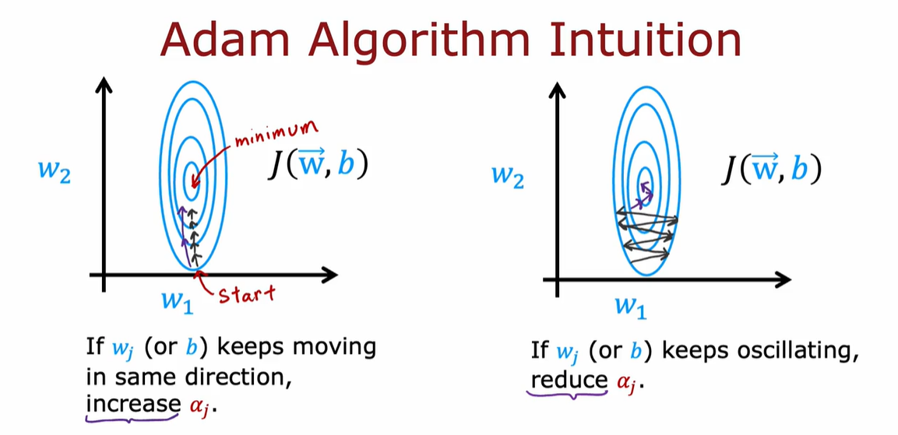

# MODEL EVALUATING
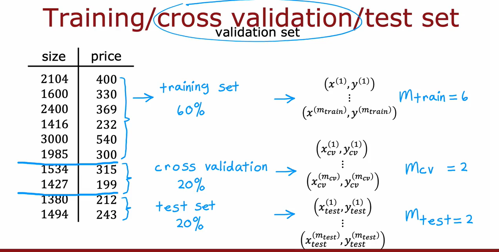
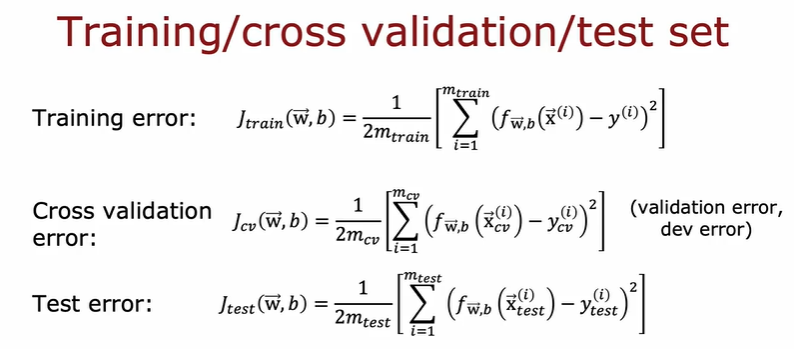
It is common to split your data into three parts:

* ***training set*** - used to train the model
* ***cross validation set (also called validation, development, or dev set)*** - used to evaluate the different model configurations you are choosing from. For example, you can use this to make a decision on what polynomial features to add to your dataset.
* ***test set*** - used to give a fair estimate of your chosen model's performance against new examples. This should not be used to make decisions while you are still developing the models.
```
# Get 60% of the dataset as the training set. Put the remaining 40% in temporary variables: x_ and y_.

x_train, x_, y_train, y_ = train_test_split(x, y, test_size=0.40, random_state=1)

# Split the 40% subset above into two: one half for cross validation and the other for the test set

x_cv, x_test, y_cv, y_test = train_test_split(x_, y_, test_size=0.50, random_state=1)

# Delete temporary variables
del x_, y_
```