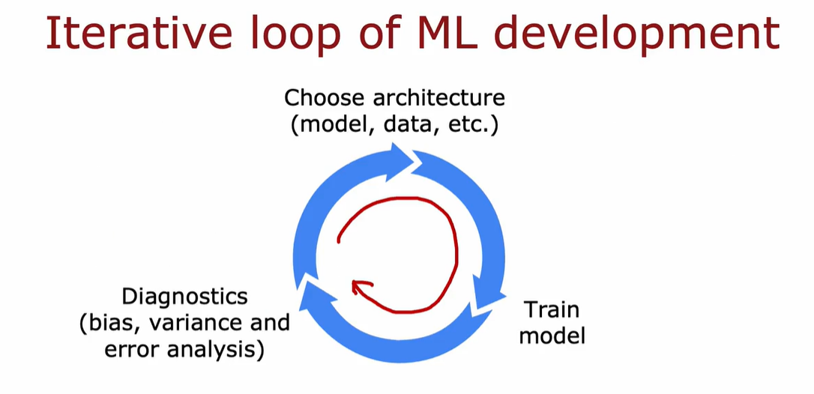
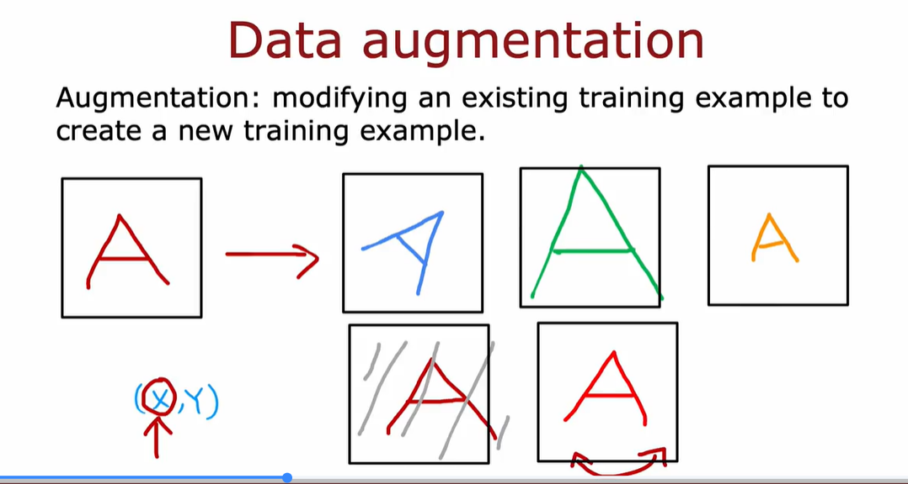
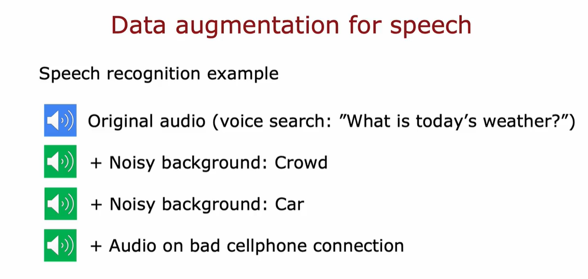
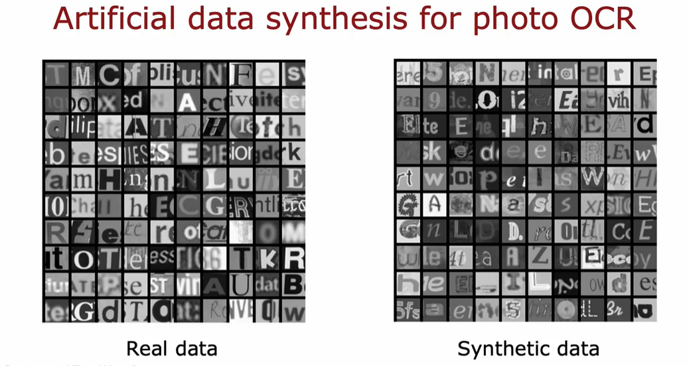
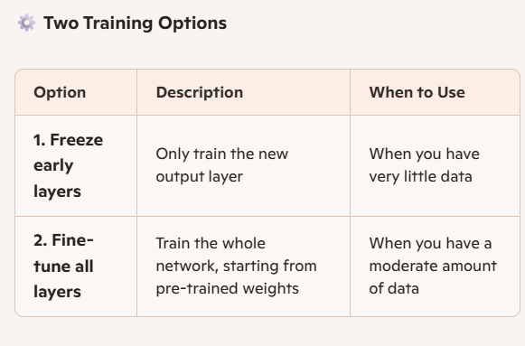

# DATA AUGMENTATION:
Modifying an existing training example to create a new training example


You can also apply distortion to the data


# DATA SYNTHESIS:
Using artificial data inputs to create new data training example

*Using different fonts to create

# TRANSFER LEARNING:
Transfer learning is a technique where a model trained on one task is reused or adapted for a different, often related task. It's especially useful when your target task has limited data.
```
Imagine you want to classify handwritten digits (0–9) but only have a small dataset. Instead of training a model from scratch, you:

Start with a pre-trained model trained on a large dataset (e.g., 1 million img/images of cats, dogs, cars, etc.).

Reuse the early layers (which learn generic features like edges, corners, and shapes).

Replace the final layer with a new output layer tailored to your task (e.g., 10 units for digits 0–9).

Fine-tune the model on your small dataset.
```
