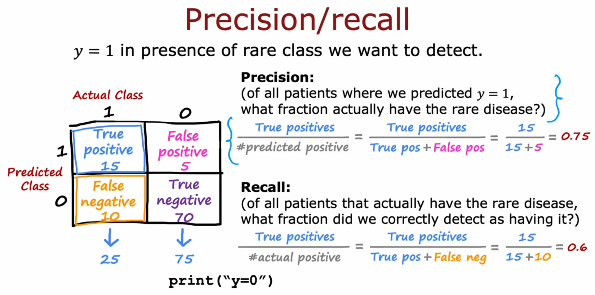

# Error metrics for very skewed datasets: to measure whether the model is useful or not

 Precision: when it says a patient has a disease, there's a good chance a patient has a disease

 Recall: of all the patients that have the disease, it's helping to diagnose a reasonable fraction of them

# F1 score

Unlike a simple average, the harmonic mean penalizes extreme values. If either precision or recall is low, the F1 score will be low. This makes it a more conservative and balanced metric.