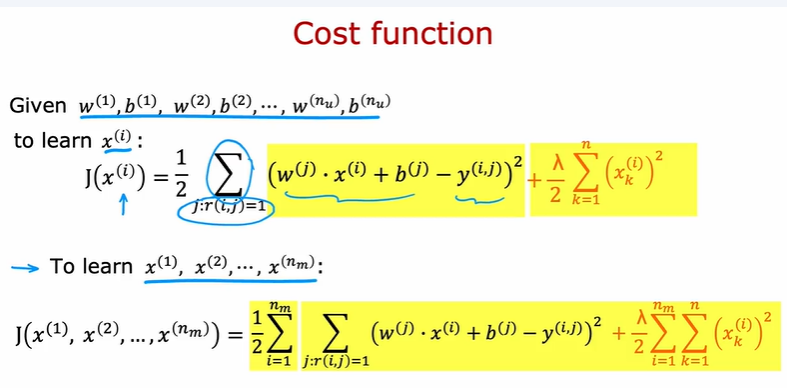
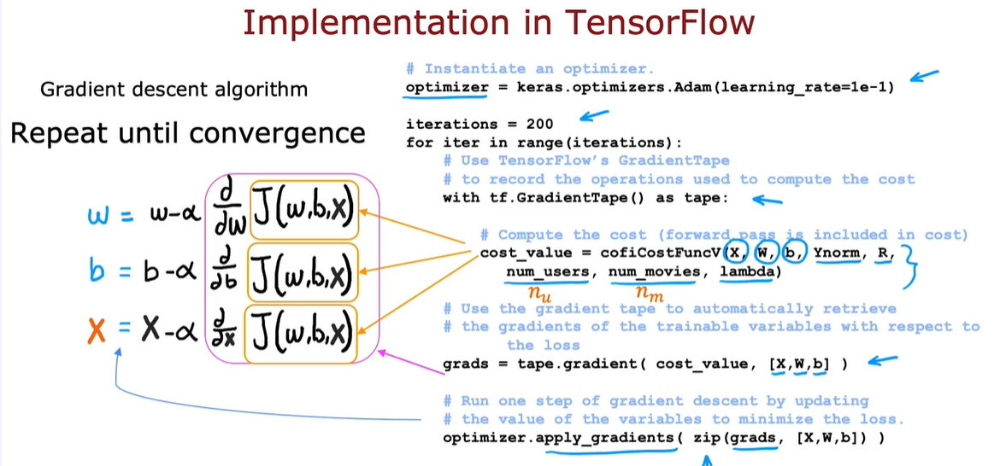

# COLABORATIVE FILTERING
Collaborative filtering makes recommendations based on user-item interactions, without needing explicit features about the items (like genre or price). It assumes that if two users rate items similarly, they likely share preferences—and can therefore be used to predict each other's ratings.

Essentially it can learn what are the item's features and also learn what are the parameters of users and predict how the users may rate the items that they have not rated.
# DATA STRUCTURES

# WHAT IF WE HAVE FEATURES OF THE ITEMS

# COST FUNCTION TO LEARN W and B
This is the cost function to learn parameters w and b for user j

To learn parameters w and b for all users:

# COST FUNCTION TO LEARN X (FEATURES OF ITEMS)

# OVERALL COST FUNCTION:

# GRADIENT DESCENT:

# BINARY LABELS: FAVS, LIKES, CLICKS

# COST FUNCTION:

where g is a logistic function 
$$g(z) = \frac{1}{1+e^{-z}}$$

# MEAN NORMALIZATION:
When there is a new user who has not rated any items yet, it is useful to do the mean normalization so that the model would better predict what the new user may rate the movie instead of 0 all the time.

# IMPLEMENTATION IN TENSORFLOW

# FINDING RELATED ITEMS
The features x_i of item i are quite hard to interpret

To find other items related to it , find item k with x_k similar to x_i

* Calculate the distance of x_k and x_i (squared distance)