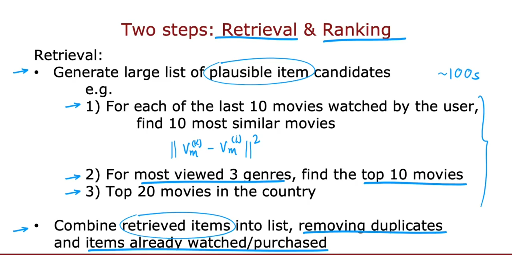

# CONTENT-BASED FILTERING
Recommend items by learning the features of users and features of items.

* Predictions for a new user

* Predictions for an existing user

* Finding similar items

# NEURAL-NETWORK ARCHITECTURE
Use deep-learning to learn feature vector of users and feature vector of items

For suggesting related items:

# RECOMMENDING FROM A LARGE CATALOGUE
## RETRIEVAL & RANKING

# IMPLEMENTATION
