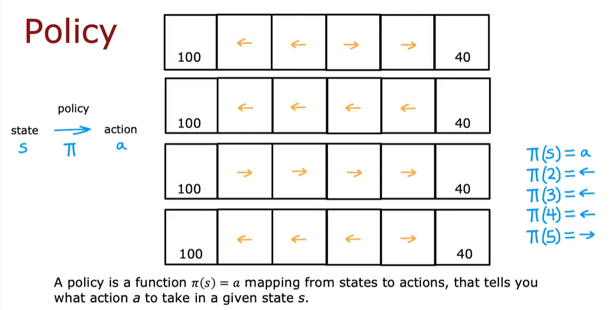
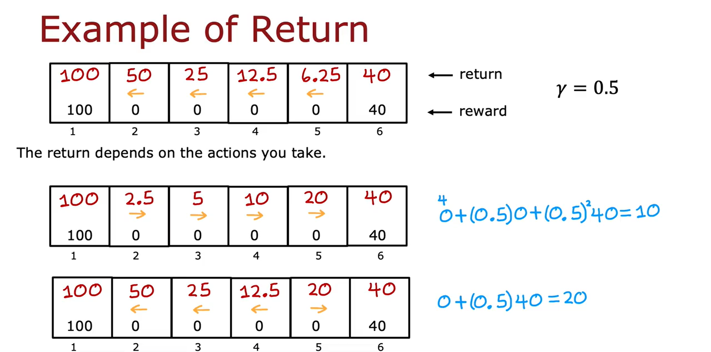
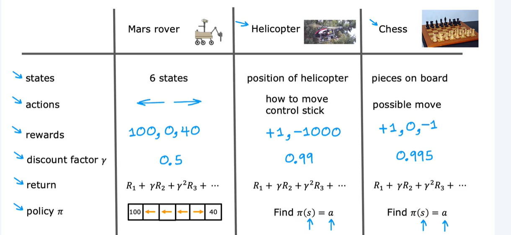
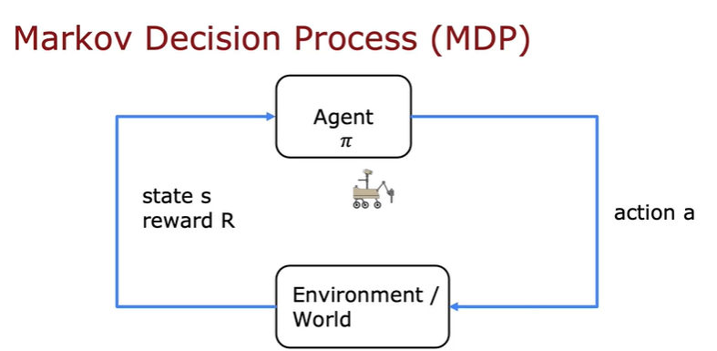
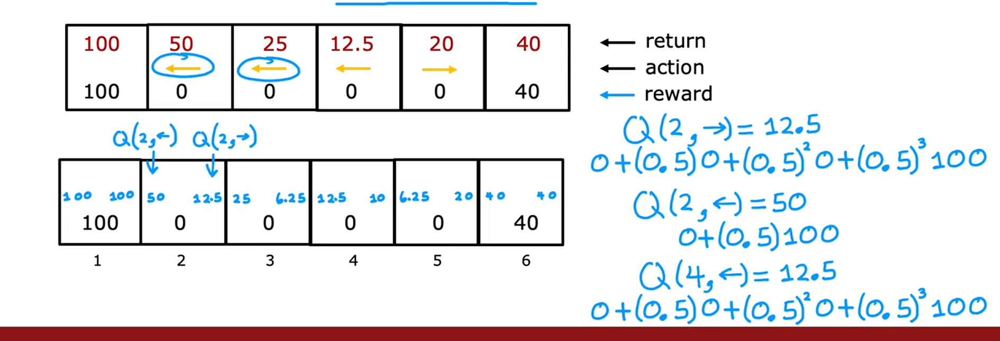
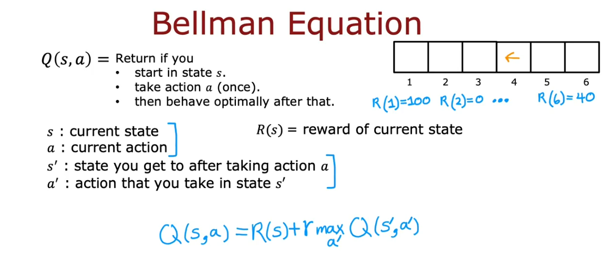
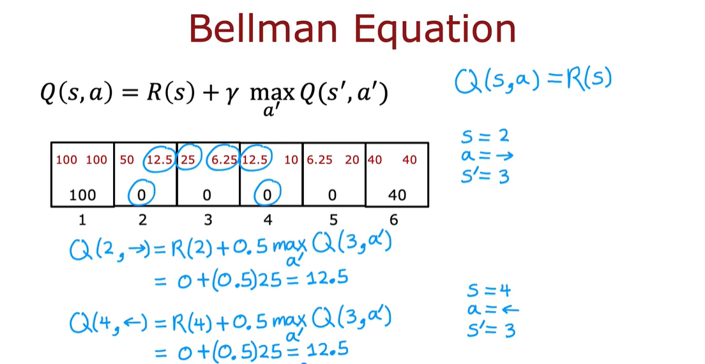
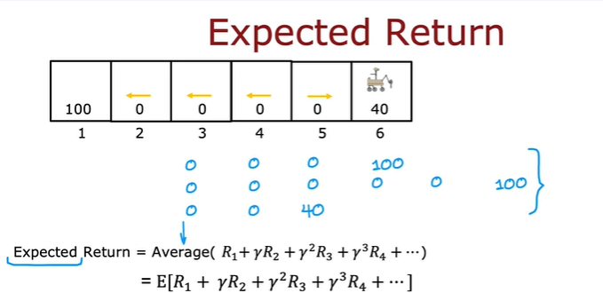
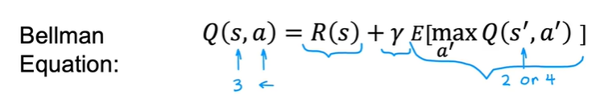
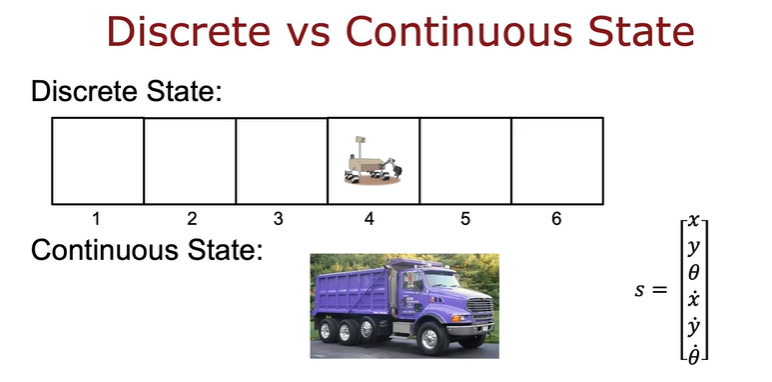

# CORE CONCEPTS
## Agent, Environment, State, Action, Reward 
RL is framed as a loop where an agent interacts with an environment, observes its state, takes actions, and receives rewards.

Rewards can be positive or negative:
* Positive rewards reinforce good behavior
* Negative rewards discourage bad ones

## Policy 
A policy is the strategy the agent uses to decide actions based on states. 

The goal of RL is to find a policy that tells you what action to take in every state so as to maximize the return
## Return and Value Functions 
It introduces the concept of cumulative reward (return) and how value functions estimate the desirability of states or actions.

## Overall

# MARKOV DECISION PROCESS (MDP)
The term Markov means that the future depends only on the current state, not on the sequence of events that preceded it

# STATE-ACTION VALUE FUNCTION (Q-FUNCTION)

Q(s,a) = return if you 
* start in state s
* take action a (once)
* then behave optimally after that

The best possible return from state s is max Q(s,a)

The best possible action in state s is the action a that gives max Q(s,a)

## Bellman Equation

If you are in the terminal state then Q(s,a) = R(s)

## Random (stochastic) environment
A stochastic environment in reinforcement learning refers to a setting where the outcome of an action is not deterministic—meaning the same action in the same state can lead to different results due to randomness.

For example: The agent might intend to go left, but due to noise, slippage, or external forces, it ends up going right.

The expected return is the average of all the return.

So the Bellman equation now become:

Choose a policy that will tell us what action a to take in state s so as to maximize the expected return

# CONTINUOUS STATE SPACES
a continuous state space means that the agent’s environment isn’t limited to a finite set of discrete states—it can occupy any value within a range, often represented by real numbers.

Self-Driving Car The state might include:
* 𝑥,𝑦 position
* Orientation angle (𝜃)
* Velocity in 𝑥 and 𝑦 directions (𝑥˙,𝑦˙)
* Angular velocity (𝜃˙)

