# LUNAR LANDER
## Actions and states
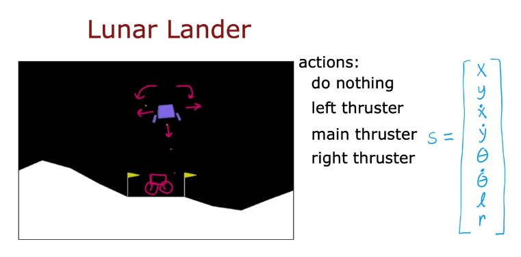
where
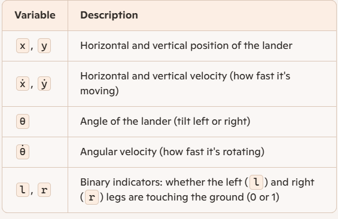
## Reward function
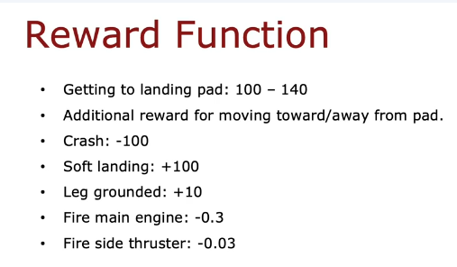

## Goal
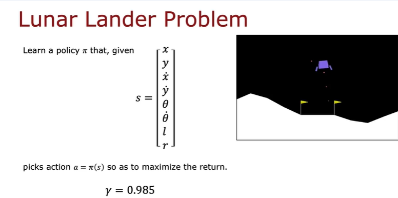

# APPROACH - (DEEP REINFORCEMENT LEARNING)
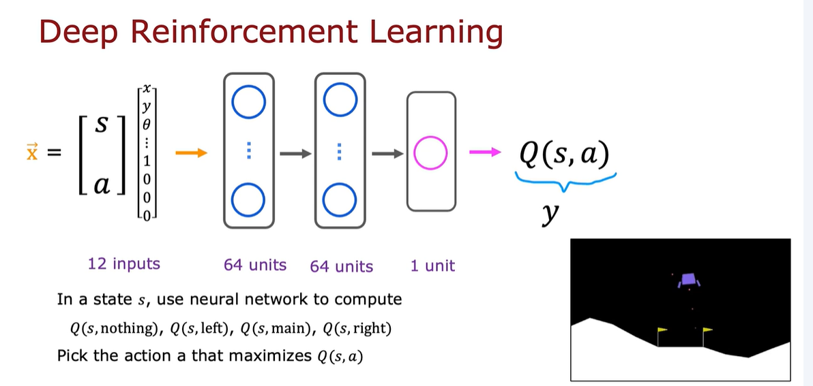
We want to create a training set and use a supervised learning method to train our neural network model. (x--->y)

We can do that using Bellman equation (for Q we can take as random number initially)
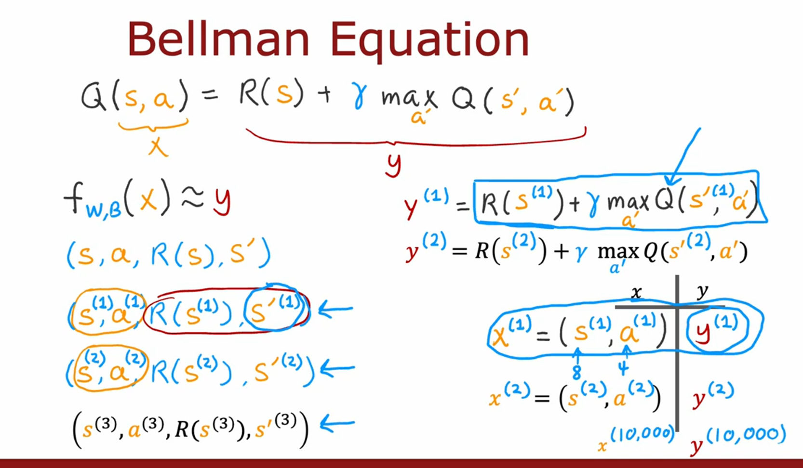

## Algorithm
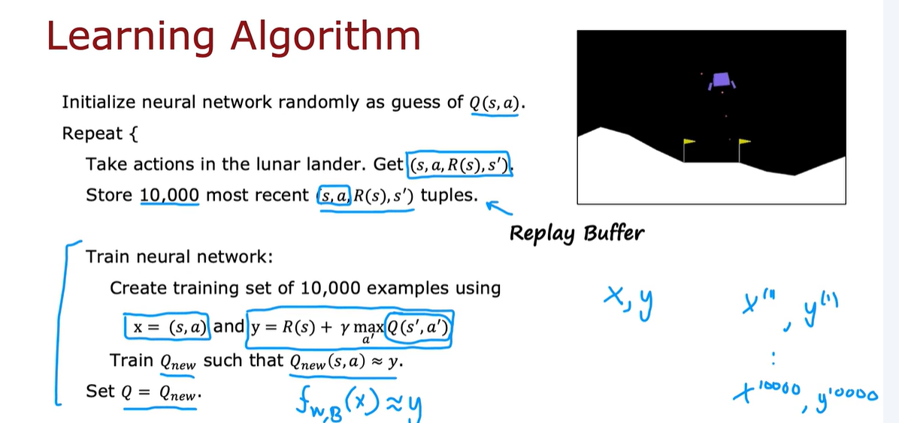

## Refinement of architecture
The input now changes to state only and output 4 neurons of 4 different actions
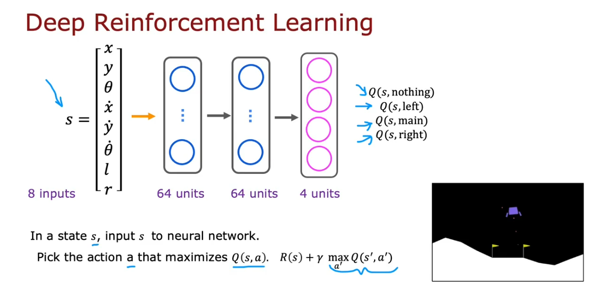

## Epsilon- greedy policy
For choosing action, it is better to do 
* With probability 0.95, pick the action a that maximizes Q(s,a). "Greedy", "Exploitation"
* With probability 0.05, pick an action a randomly. "Exploration"
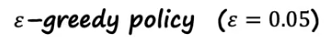

Start epsilon high and gradually decrease over time. (1.0 ---> 0.01)

## Mini-batch 
Instead of using:

* All data (batch gradient descent)

* Or just one example at a time (stochastic gradient descent)

Mini-batch gradient descent uses a small subset of the data—called a mini-batch—to compute the gradient and update the model parameters.
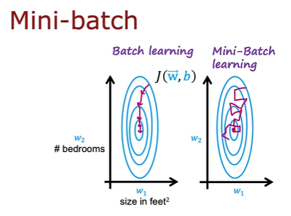

*So instead of using the 10000 most recent tuples to create the training set. We only need to use 1000 examples.

## Soft update
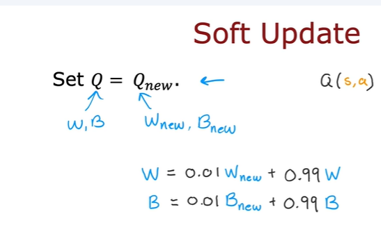