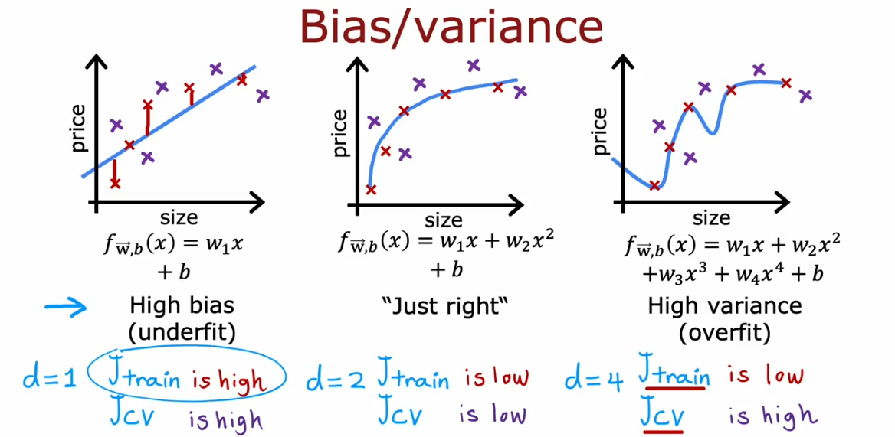
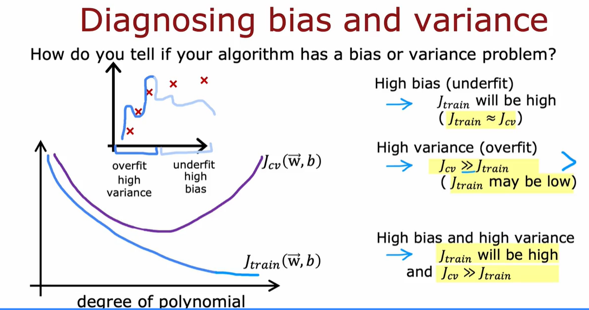
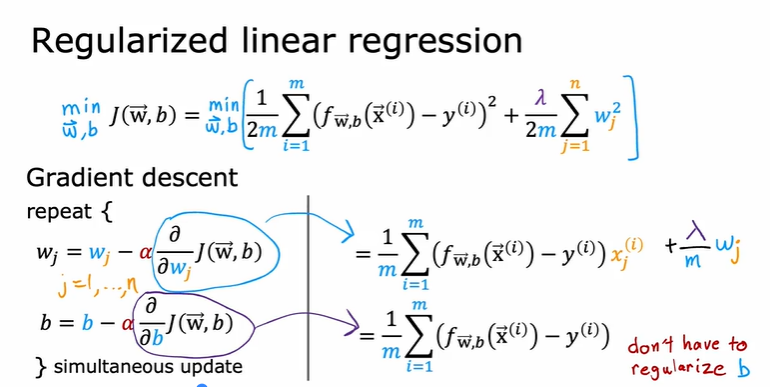
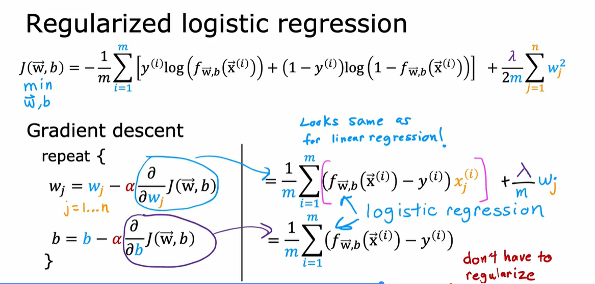
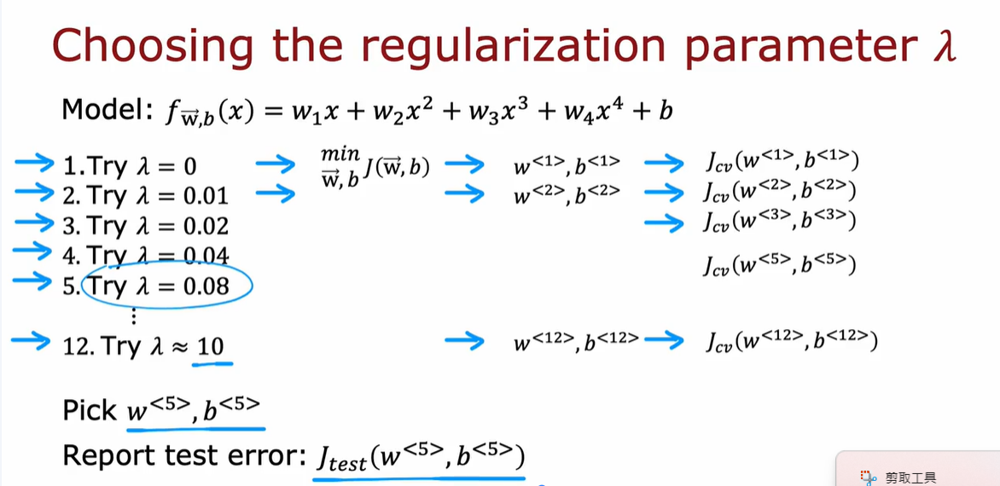
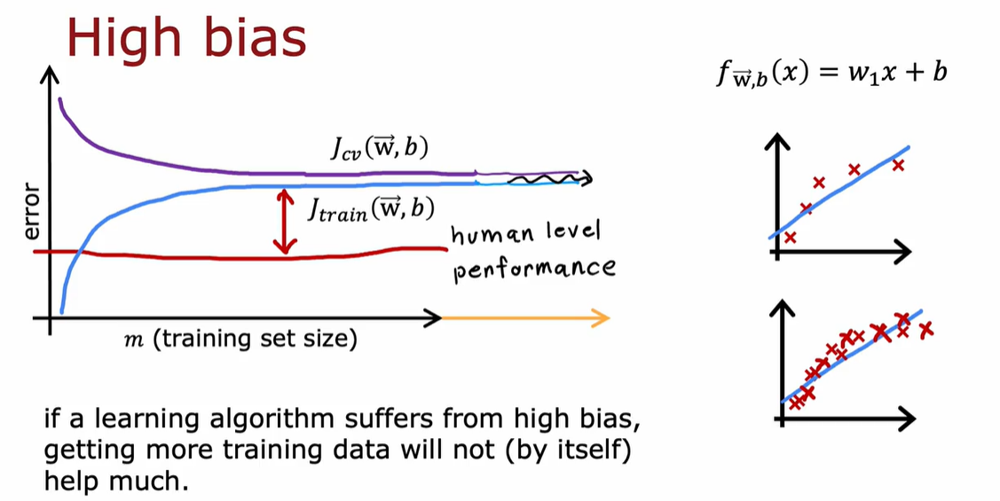
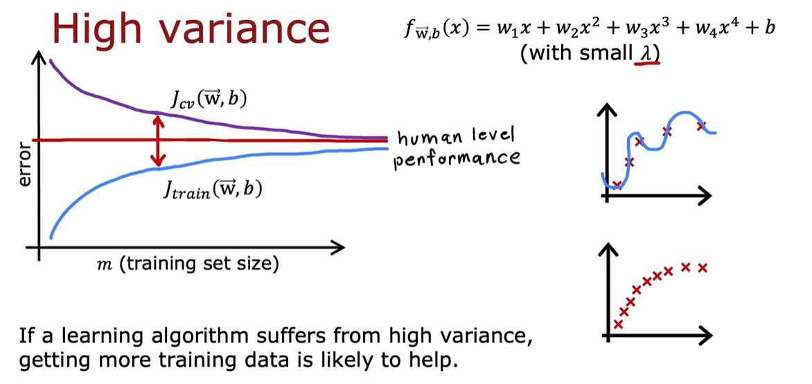
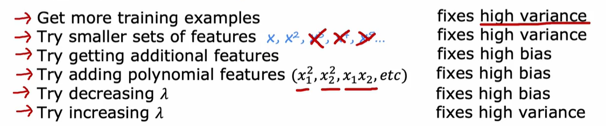
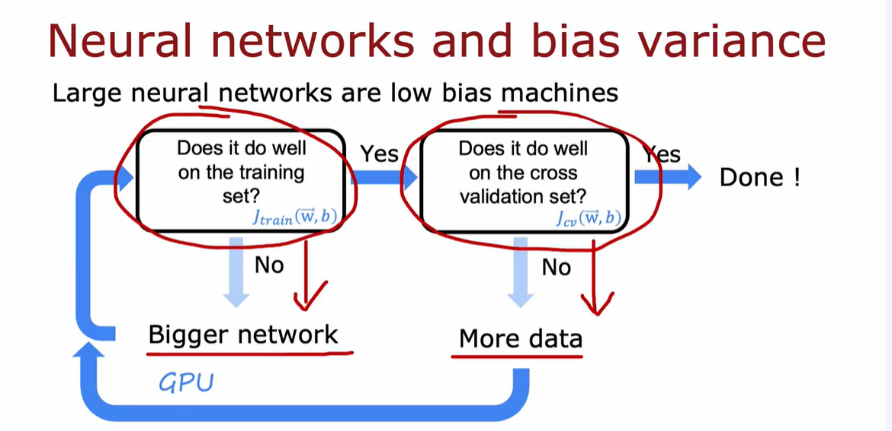

# High Bias
Bias is like having a rigid mindset—the model assumes too much simplicity.

Model makes strong assumptions and fails to capture patterns in the data.

# High Variance
Variance is like being too reactive—the model changes drastically with small data variations.

Model fits training data too closely, capturing noise as if it were signal.
# Diagnosing


# Adress overfitting
* Collect more data

* Select features
    * Feature selection

* Reduce size of parameters:
    * Regularization

# Regularization
## Linear Regression

## Logistic Regression




# Learning curve



# In General



```
layer_1= Dense(25,activation="relu", kernel_regularizer=L2(0.01))

layer_2= Dense(15,activation="relu", kernel_regularizer=L2(0.01))

layer_3= Dense(1,activation="sigmoid", kernel_regularizer=L2(0.01))

mode= Sequential([layer_1,layer_2,layer_3])
```