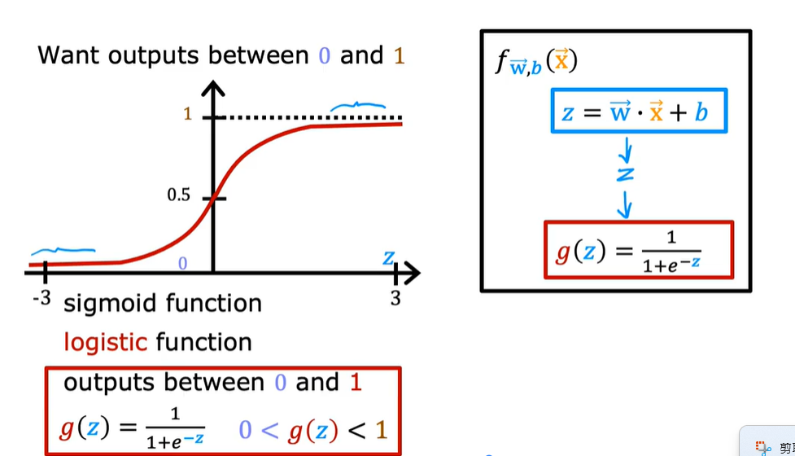
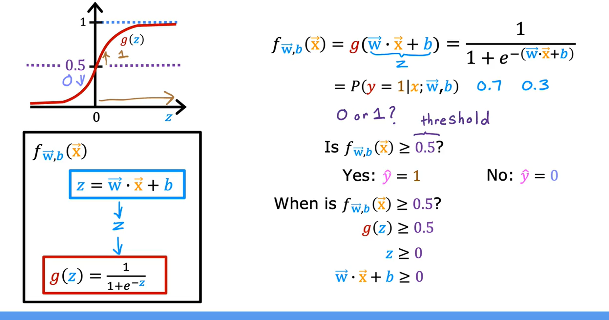
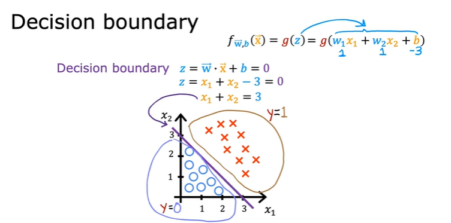
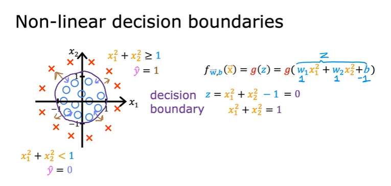
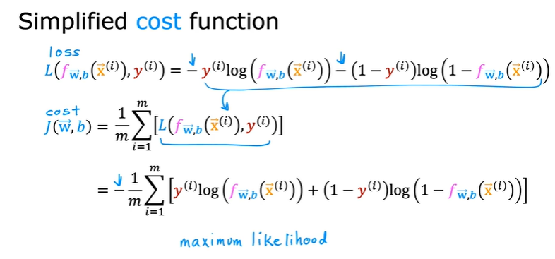
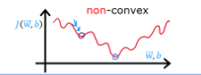
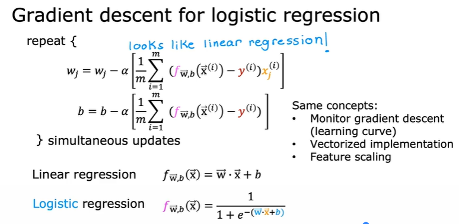

# MODEL:
A logistic regression model applies the sigmoid to the familiar linear regression model as shown below:

$$ f_{\mathbf{w},b}(\mathbf{x}^{(i)}) = g(\mathbf{w} \cdot \mathbf{x}^{(i)} + b ) $$
  where 
  $$g(z) = \frac{1}{1+e^{-z}}$$
  

# DECISION BOUNDARY:


## Linear decision boundary:

```
This line separates the space into two regions:

Above the line: Predict 𝑦=1

Below the line: Predict 𝑦=0
```
## Non-linear decision boundary:

```
By using polynomial features, logistic regression can learn more complex boundaries:

Decision boundary:  𝑥1^2+𝑥2^2=1 which is a circle

More complex combinations (e.g., 
𝑥1*𝑥2, 𝑥1^2, etc.) can yield ellipses, curves, or even irregular shapes.
```

# COST FUNCTION:


# VISUALIZATION:


# GRADIENT DESCENT:
