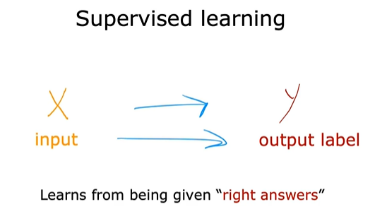
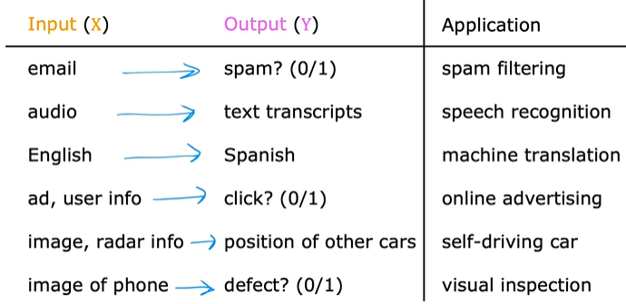
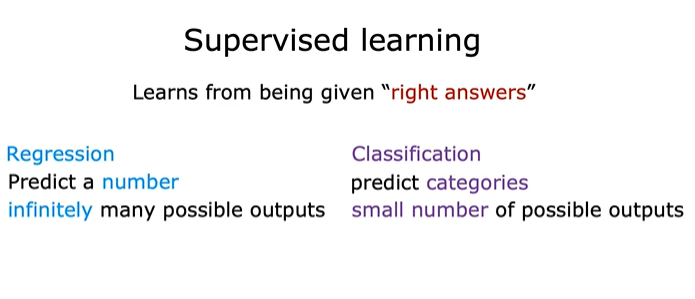

# *Supervised learning* 
A type of machine learning where an algorithm learns to map inputs (denoted as x) to outputs (denoted as y) using labeled training data.

## *Applications:*

## *Regression* vs *Classification*
