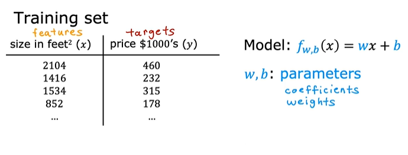
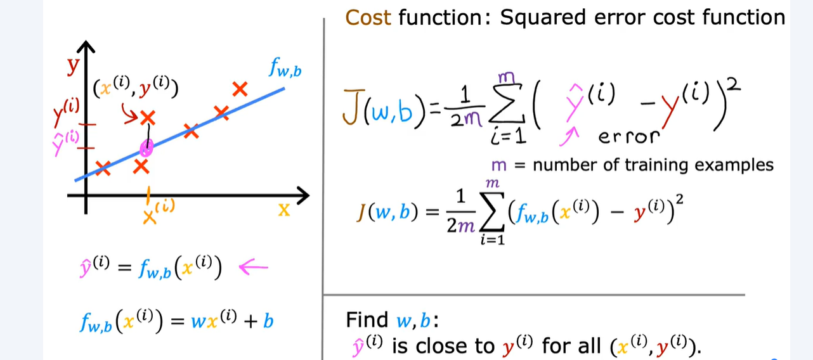
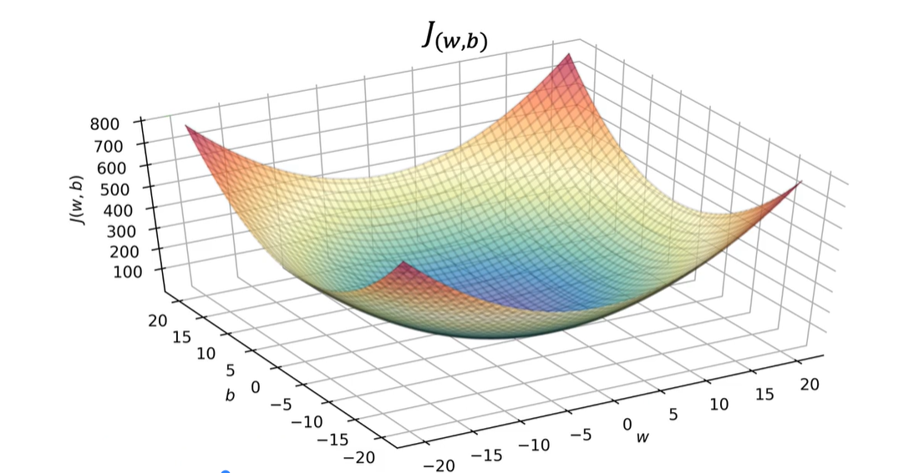
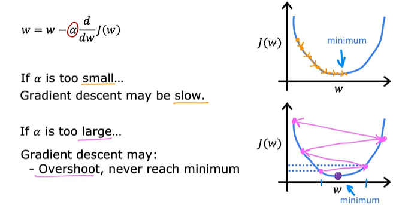

# MODEL:
$$f_{w,b}(x^{(i)}) = wx^{(i)} + b$$



# COST FUNCTION: 
$$J(w,b) = \frac{1}{2m} \sum\limits_{i = 0}^{m-1} (f_{w,b}(x^{(i)}) - y^{(i)})^2$$


## Visualization Of Cost Function: CONVEX


# GRADIENT DESCENT:
### The goal is to minimize the cost function by updating model parameters *```w```* and *```b```*
### *```w```* and *```b```* are initialized random numbers at first.
*Gradient descent* was described as:

$$\begin{align*} \text{repeat}&\text{ until convergence:} \; \lbrace \newline
\;  w &= w -  \alpha \frac{\partial J(w,b)}{\partial w}   \; \newline 
 b &= b -  \alpha \frac{\partial J(w,b)}{\partial b}  \newline \rbrace
\end{align*}$$
where, parameters $w$, $b$ are updated simultaneously.  
The gradient is defined as:
$$
\begin{align}
\frac{\partial J(w,b)}{\partial w}  &= \frac{1}{m} \sum\limits_{i = 0}^{m-
1} (f_{w,b}(x^{(i)}) - y^{(i)})x^{(i)} \\
  \frac{\partial J(w,b)}{\partial b}  &= \frac{1}{m} \sum\limits_{i = 0}^{m-1} (f_{w,b}(x^{(i)}) - y^{(i)}) \\
\end{align}
$$

Here *simultaniously* means that you calculate the partial derivatives for all the parameters before updating any of the parameters.

## Local vs global minimum:
* In Linear Regression:

    *  The cost function (usually Mean Squared Error) is convex—it looks like a smooth bowl.

    * This means there is only one minimum, and gradient descent is guaranteed to find the global minimum, regardless of where you start.

* In More Complex Models (e.g., Neural Networks):

    * The cost function can be non-convex, with many hills and valleys.

    * Gradient descent may find a local minimum depending on the starting point.

    * It’s possible to get stuck in a suboptimal valley, especially in high-dimensional spaces.

## Learning rate:


## "Batch" gradient descent:
```Batch```: Each step of gradient descent uses all the training examples.

## "Subset" gradient descent:
```Subset```: Each step of gradient descent uses only a subset of the training examples.

