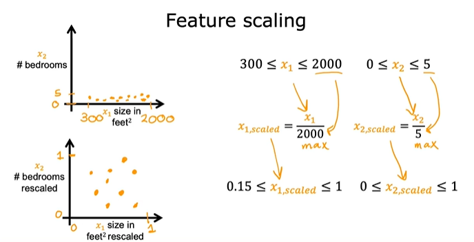
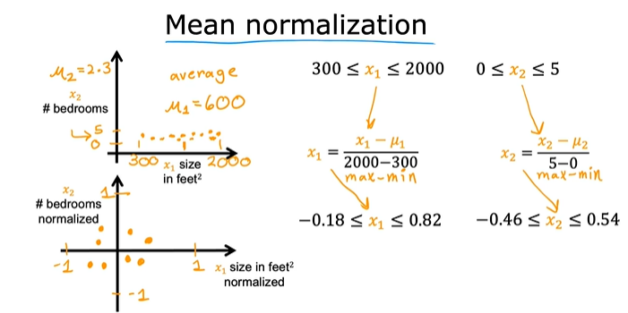
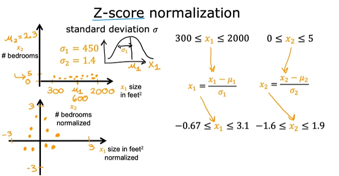
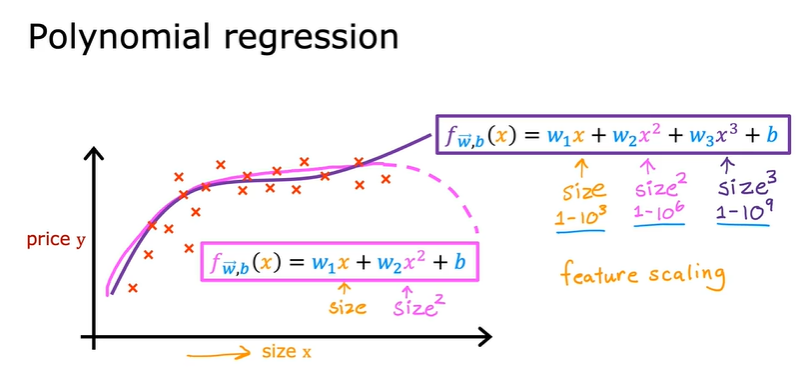

# Vectorization:
Each row of the matrix represents one example. When you have  𝑚
  training examples (  𝑚
  is three in our example), and there are  𝑛
  features (four in our example),  𝐗
  is a matrix with dimensions ( 𝑚
 ,  𝑛
 ) (m rows, n columns).
$$\mathbf{X} = 
\begin{pmatrix}
 x^{(0)}_0 & x^{(0)}_1 & \cdots & x^{(0)}_{n-1} \\ 
 x^{(1)}_0 & x^{(1)}_1 & \cdots & x^{(1)}_{n-1} \\
 \cdots \\
 x^{(m-1)}_0 & x^{(m-1)}_1 & \cdots & x^{(m-1)}_{n-1} 
\end{pmatrix}
$$
notation:
- $\mathbf{x}^{(i)}$ is vector containing example i. $\mathbf{x}^{(i)}$ $ = (x^{(i)}_0, x^{(i)}_1, \cdots,x^{(i)}_{n-1})$
- $x^{(i)}_j$ is element j in example i. The superscript in parenthesis indicates the example number while the subscript represents an element.  

```w``` and ```x``` are now vectors with ***n*** elements
$$\mathbf{w} = \begin{pmatrix}
w_0 \\ 
w_1 \\
\cdots\\
w_{n-1}
\end{pmatrix}
$$

The model's prediction with multiple variables is given by the linear model:

$$ f_{\mathbf{w},b}(\mathbf{x}) =  w_0x_0 + w_1x_1 +... + w_{n-1}x_{n-1} + b \tag{1}$$
or in vector notation:
$$ f_{\mathbf{w},b}(\mathbf{x}) = \mathbf{w} \cdot \mathbf{x} + b  \tag{2} $$
where $\cdot$ is a vector `dot product`

# Feature Scaling:

Feature scaling transforms input variables so they have comparable ranges, typically between 0 and 1 or with zero mean and unit variance. This prevents features with larger numeric ranges from dominating the learning process.This makes training more stable and efficient.

    * Gradient descent converges faster when features are scaled.

    * Prevents the model from bouncing erratically due to disproportionate feature magnitudes.

    * Makes contour plots of the cost function more circular, allowing smoother descent to the global minimum.





# Feature engineering
The process of creating new input features from your existing data to improve the performance of machine learning models

Feature engineering involves:

  * Using domain knowledge or intuition to create new features.

  * Transforming or combining existing features to better capture patterns in the data.

  * Improving model accuracy by making the data more informative.

```
Example: Predicting House Prices
  * Original features:

𝑥1 : Width of the lot (frontage)

𝑥2 : Depth of the lot

Initial model: 
𝑓(𝑥)=𝑤1*𝑥1+𝑤2*𝑥2+𝑏

This model works, but it might not capture the most predictive aspect of the data.

  * Engineered Feature:
New feature: 
𝑥3=𝑥1*𝑥2 (area of the lot)

Updated model: 
𝑓(𝑥)=𝑤1*𝑥1+𝑤2*𝑥2+𝑤3*𝑥3+𝑏

By introducing 𝑥3, the model can now learn whether frontage, depth, or area is most predictive of house price
```

# Polynomial Regression
