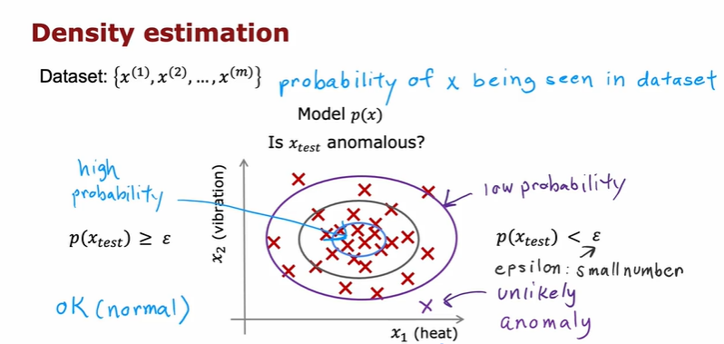
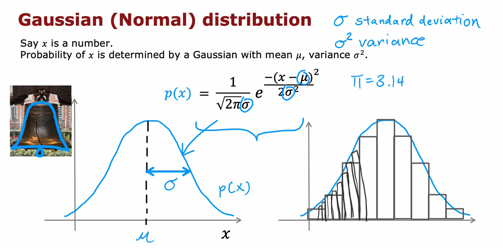
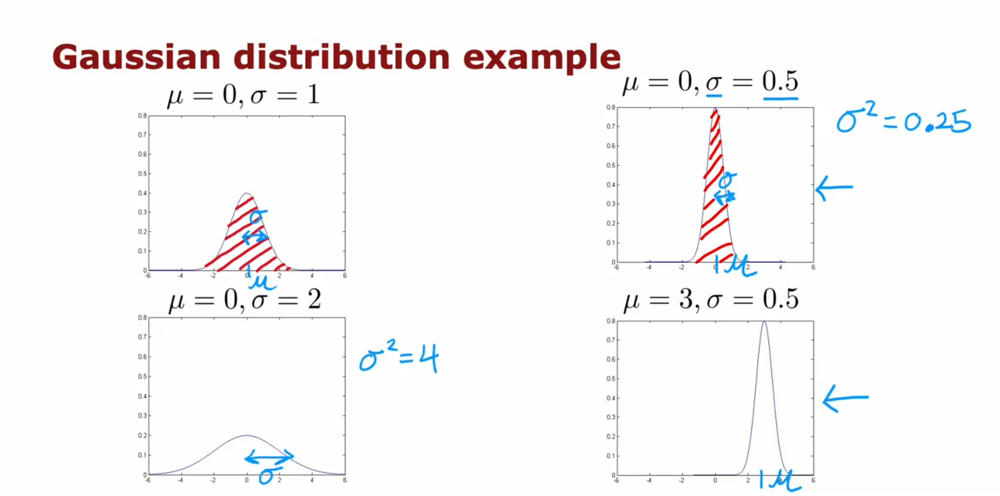
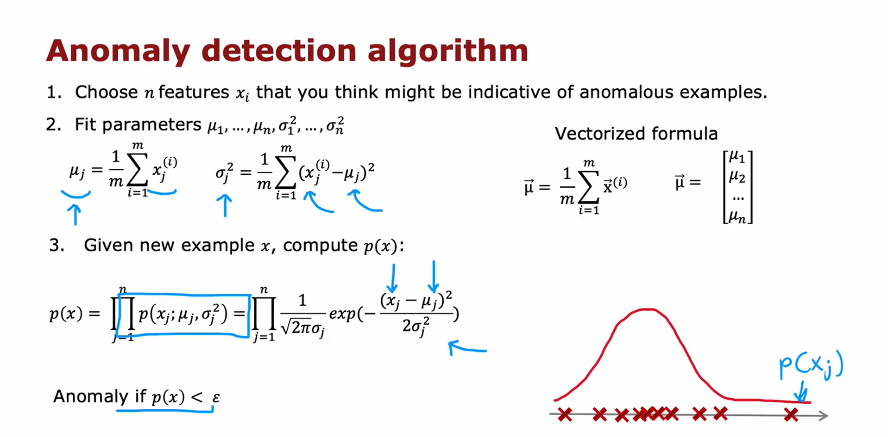
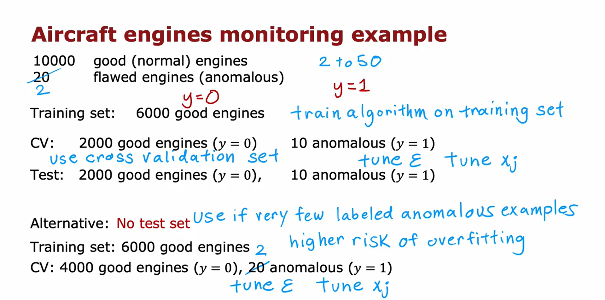
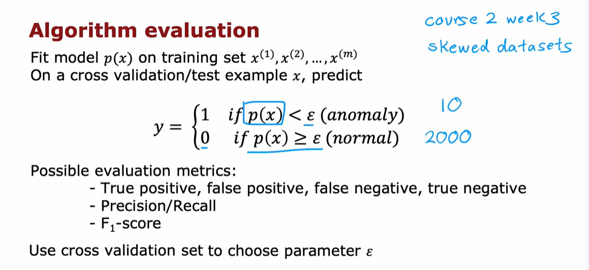
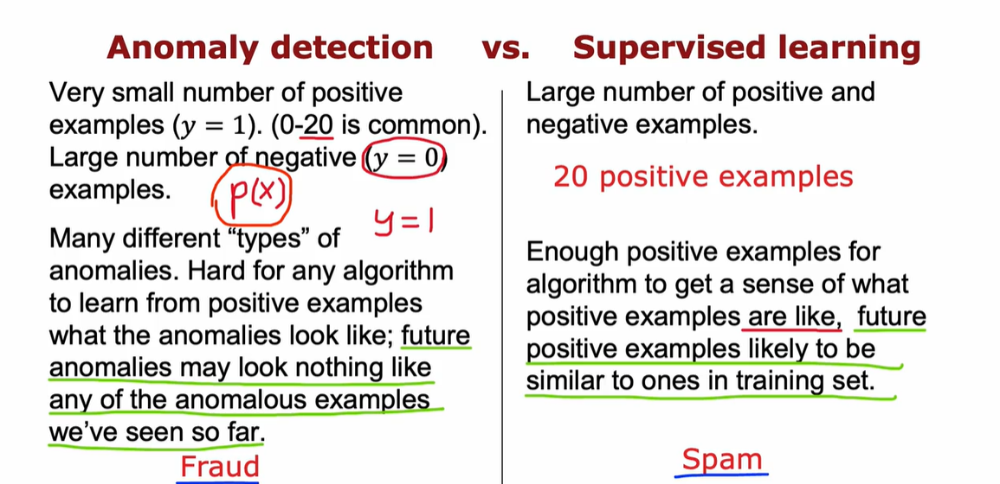
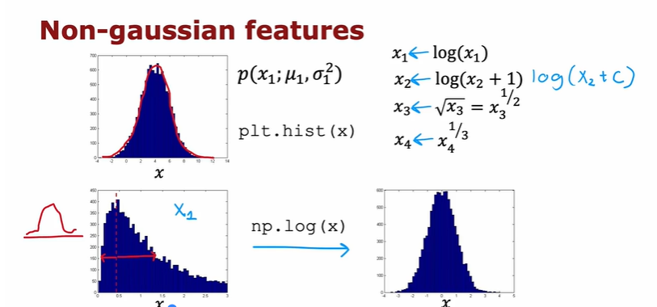

# DENSITY ESTIMATION

* You model the probability distribution 𝑝(𝑥) of the input features.

* For a new data point 𝑥test, you compute 𝑝(𝑥test).

    * If 𝑝(𝑥test)<𝜀 (a small threshold), it's flagged as an anomaly.

    * If 𝑝(𝑥test)≥𝜀, it's considered normal.

This approach is known as density estimation, often using Gaussian distributions to model the data.

# GAUSSIAN (NORMAL) DISTRIBUTION

$$ p(x ; \mu,\sigma ^2) = \frac{1}{\sqrt{2 \pi \sigma ^2}}\exp^{ - \frac{(x - \mu)^2}{2 \sigma ^2} }$$
$$\mu_i = \frac{1}{m} \sum_{j=1}^m x_i^{(j)}$$
$$\sigma_i^2 = \frac{1}{m} \sum_{j=1}^m (x_i^{(j)} - \mu_i)^2$$

# ALGORITHM

# EVALUATING THE MODEL
Assume we have some labeled data, of anomalous and non-anomalous examples.

Because the dataset is skewed, we can use metrics like precision/recall, F1-score

# WHEN TO USE ANOMALY DETECTION VS SUPERVISED LEARNING

# CHOOSING WHAT FEATURES TO USE
## Changing non-gaussian features into more gaussian
1. Plot Histograms of Each Feature

    * Identify which features are highly skewed or non-Gaussian.

    * Use transformations (e.g., log, square root, power) to make them more symmetric.

2. Assess Feature Utility

    * Ask: Does this feature help separate normal from anomalous examples?

    * If a feature is irrelevant (e.g., constant across examples or noisy), transforming it won’t help—just drop it.

3. Transform Selectively

    * Only transform features that:

        * Are non-Gaussian and

        * Contribute meaningfully to anomaly detection.

4. Validate on Cross-Validation Set

    * After training, check which anomalies are missed.

    * If a feature fails to help distinguish anomalies even after transformation, consider engineering new features instead.

## Sometimes you need to come up with the new features that you think would contribute to the effectiveness of the model
Either it is completely new features or it is old features combined together using some formulas.