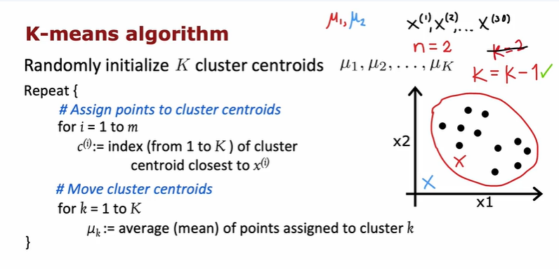
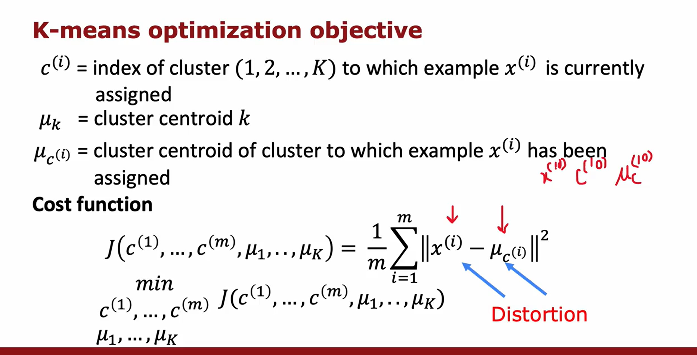
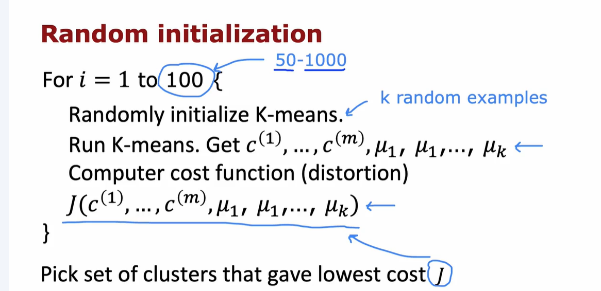
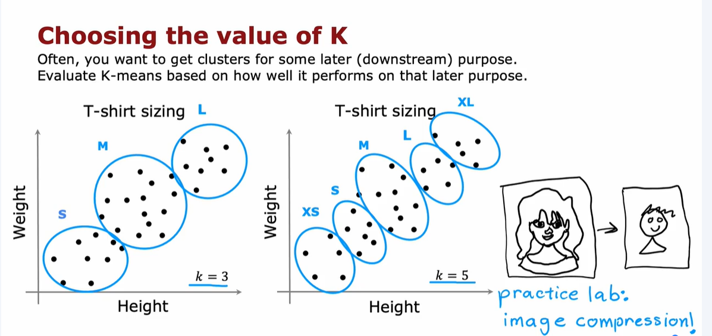

# CLUSTERING
The goal is to discover structure in the data- specifically, to identify clusters of similar points even if the data is not well separated into groups or clusters.

Unlike supervised learning, clustering doesn’t rely on labeled data. You’re given only the input features 𝑥, not the target labels 𝑦.

# K-MEANS ALGORITHM
Intuition: Visualize how data points can be grouped based on proximity.

Algorithm Steps:

1. Initialize random cluster centers

2. Assign points to the nearest center

3. Update centers based on assigned points

4. Repeat until convergence

k= k-1 (eliminate a cluster if there is no points assigned to it)

# OPTIMIZATION OBJECTIVE

# RANDOM INITIALIZATION

Random initialize K-means at random training example.

Run the for loop to find the lowest cost function because some initialization will result in the sets of clusters that present local minimum.

Just pick the set of clusters that gave the lowest cost

# CHOOSING THE VALUE K
