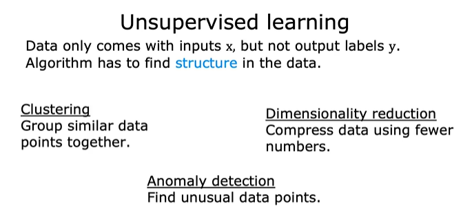

# *Unsupervised learning*
A type of machine learning where the algorithm is given data without any labeled outputs—meaning there’s no “correct answer” provided. Instead of learning to predict a specific outcome, the algorithm tries to discover patterns, structures, or relationships within the data on its own.

# *Techniques*
